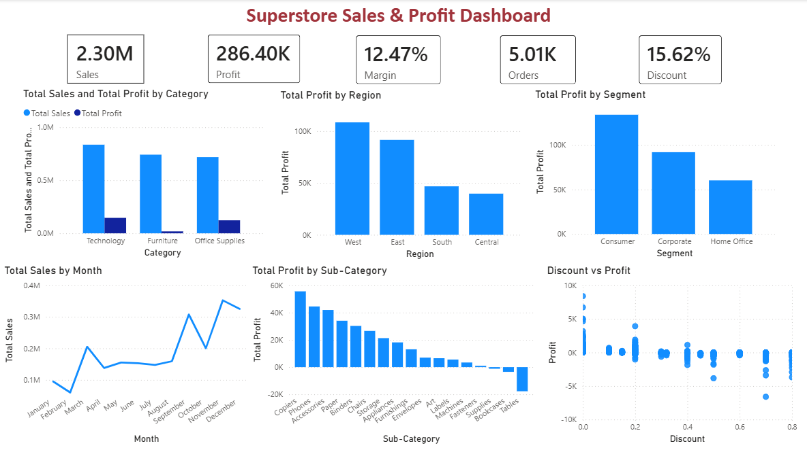

# 📊 Superstore Sales Analytics

## 📌 Project Overview

Superstore Sales Analytics is an end-to-end data analytics project focused on analyzing retail sales, profitability, discounts, regional performance, and customer segments.

The project uses Python, SQL, and Power BI to clean data, perform exploratory analysis, identify business problems, and build an interactive dashboard for decision-making.

---

## 🎯 Business Objectives

- Analyze sales and profit performance across categories, products, regions, and customer segments.
- Identify profitability gaps and understand the impact of discounts on profit.
- Develop actionable business recommendations using data-driven insights.

---

## 📈 Key KPIs

| KPI | Value |
|---|---:|
| Total Sales | $2.30M |
| Total Profit | $286.4K |
| Profit Margin | 12.47% |
| Total Orders | 5,009 |
| Average Discount | 15.62% |

---

## 🛠️ Tech Stack

- **Python:** Pandas, NumPy, Matplotlib, Seaborn
- **SQL:** Data analysis and aggregations
- **Power BI:** Interactive dashboard, KPIs, and visualizations
- **Jupyter Notebook:** Data analysis and business analysis
- **GitHub:** Version control and project documentation

---

## 🔍 Analysis Performed

### Data Cleaning & EDA
- Handled missing values and duplicate records.
- Converted and validated date fields.
- Performed descriptive statistics and exploratory data analysis.
- Analyzed sales, profit, discounts, products, regions, and customer segments.

### Business Analysis
- High Sales vs Low Profit analysis
- Profit Margin analysis
- Discount vs Profit analysis
- Regional and sub-category profitability
- Segment and category performance
- Root-cause analysis of loss-making products

### Power BI Dashboard

Built an interactive dashboard containing:

- Total Sales, Profit, Profit Margin, Orders, and Average Discount KPIs
- Sales & Profit by Category
- Profit by Region
- Profit by Customer Segment
- Monthly Sales Trend
- Profit by Sub-Category
- Discount vs Profit analysis

---

## 💡 Key Business Insights

- **Technology** generated the highest overall sales and profit among the three categories.
- **West** was the strongest region in terms of both sales and profitability.
- **Consumer** generated the highest sales and total profit among customer segments.
- **Copiers** had the highest profit margin, while **Tables** showed negative profitability despite strong sales.
- Higher discounts were associated with lower profitability, particularly for **Tables**.
- **East-region Tables** showed the highest regional loss, with heavy discounts contributing significantly.
- **Furniture** generated a loss in the Central region.

---

## 📌 Business Recommendations

1. Reduce heavy discounts on Tables, especially in the East region.
2. Review pricing and margins for low-profit products such as Tables, Bookcases, and Machines.
3. Focus on high-profit products such as Copiers and Phones.
4. Investigate Furniture profitability in the Central region.
5. Maintain strong focus on Technology due to its consistent profitability.

---

## 📊 Dashboard Preview



---

## 📁 Project Structure

```text
Superstore-Sales-Analytics/
│
├── datasets/
│   ├── raw/
│   │   └── superstore.csv
│   └── cleaned/
│
├── notebooks/
│   ├── 01_Data_Cleaning.ipynb
│   └── 02_Business_Analysis.ipynb
│
├── images/
│   ├── sales_by_category.png
│   ├── profit_by_region.png
│   ├── correlation_heatmap.png
│   ├── monthly_sales_trend.png
│   ├── profit_by_subcategory.png
│   ├── discount_vs_profit.png
│   └── powerbi_dashboard.png
│
├── powerbi/
│   └── Superstore_Sales_Analytics_Dashboard.pbix
│
└── README.md