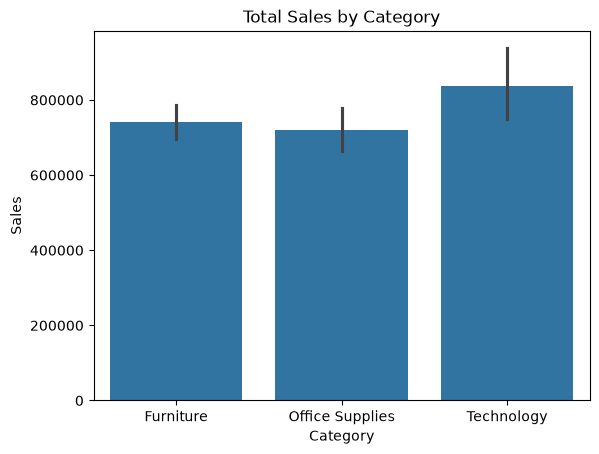
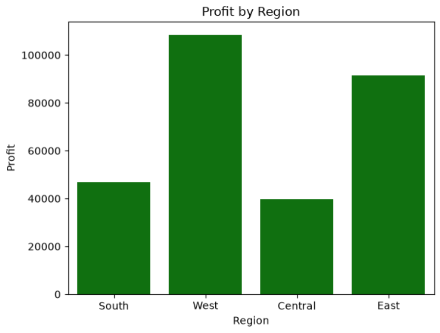
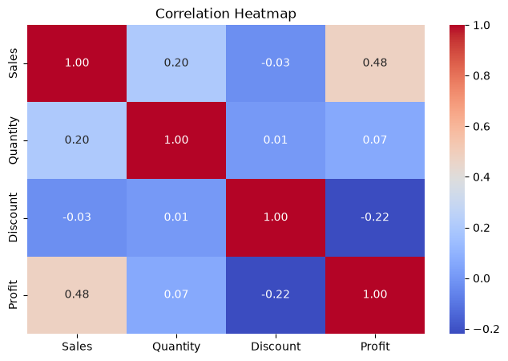
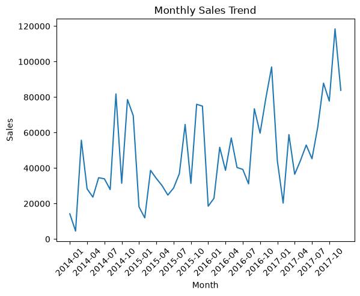
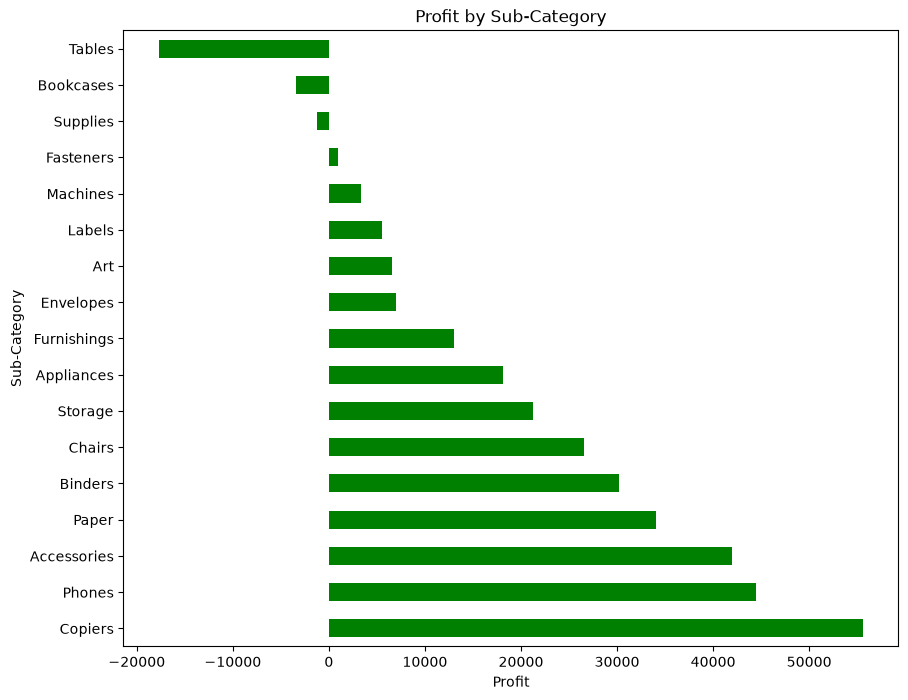

# 📊 Superstore Sales Analytics

> An end-to-end Data Analytics project using Python to analyze sales, profitability, customer segments, regional performance, product performance, and discount impact from the Superstore dataset.

---

## 🚀 Project Overview

This project analyzes **9,994 Superstore transactions** using Python to transform raw transactional data into actionable business insights.

The analysis focuses on:

- 📈 Sales performance
- 💰 Profitability
- 🌎 Regional & state performance
- 👥 Customer segments
- 📦 Category & sub-category performance
- 🚚 Shipping patterns
- 🎯 Discount impact
- 📅 Monthly sales & profit trends
- 🔎 Business problem and root-cause analysis

---

## 🎯 Business Objectives

The project focuses on answering key business questions:

- Which products generate high sales but low profit?
- How does discounting affect profitability?
- Which regions and products are underperforming?
- Which customer segments generate the highest profit?
- Where are the major profitability gaps?
- What actions can improve overall business profitability?

---

## 📊 Key KPIs

| KPI | Value |
|------|------:|
| Total Sales | $2.30M |
| Total Profit | $286.4K |
| Profit Margin | 12.47% |
| Total Orders | 5,009 |
| Average Discount | 15.62% |
| Records Analyzed | 9,994 |

---

## 📸 Project Highlights












---

## 🛠️ Tech Stack

| Tool | Purpose |
|------|---------|
| 🐍 Python | Data analysis |
| 🐼 Pandas | Data cleaning & analysis |
| 🔢 NumPy | Numerical operations |
| 📊 Matplotlib | Data visualization |
| 🎨 Seaborn | Statistical visualization |
| 📓 Jupyter Notebook | Analysis & documentation |

---

## 🔍 Analysis Performed

### 1. Data Cleaning & Preparation

- Checked dataset structure and data types
- Converted `Order Date` and `Ship Date` to datetime
- Checked missing values
- Checked duplicate records
- Created time-based features such as `Month`

### 2. Exploratory Data Analysis

Analyzed:

- Total Sales
- Total Profit
- Average Profit
- Quantity
- Discount
- Category performance
- Regional performance
- Customer segments
- State-level performance
- Sub-category performance
- Shipping modes
- Monthly trends

### 3. Business Problem Analysis

Performed deeper analysis to identify profitability gaps and their possible causes.

Key areas analyzed:

- High Sales vs Low Profit products
- Profit Margin by sub-category
- Discount vs Profit
- Tables profitability by discount level
- Regional sub-category profitability
- East region Tables root-cause analysis
- Segment profitability
- Segment × Category profitability
- Category × Region profitability

---

## 💡 Key Business Insights

### 🏆 Category Performance

**Technology** generated the highest overall Sales and Profit among the three categories.

### 🌎 Regional Performance

The **West region** was the strongest performer in terms of both Sales and Profit.

### 👥 Customer Segments

The **Consumer segment** generated the highest Sales and Profit, while **Home Office** had the highest profit margin.

### 📍 State Performance

**California** was the leading state in both Sales and Profit.

### 📦 Product Performance

**Phones** generated the highest Sales, while **Copiers** generated the highest Profit and Profit Margin.

### ⚠️ Profitability Gap

**Tables** generated high sales but negative overall profit, making them a major profitability concern.

### 🎯 Discount Impact

Higher discounts were associated with lower profitability. For Tables, profit margin declined sharply from **18.55% at 0% discount to -63% at 50% discount**.

### 🌎 Regional Root Cause

Tables generated the highest loss in the **East region (~$11K)**, with the majority of the loss occurring at the **40% discount level**.

### 🪑 Furniture Performance

Furniture generated a loss in the **Central region**, making it an area requiring further investigation.

---

## 📌 Business Recommendations

1. **Reduce heavy discounts on Tables**, especially in the East region.
2. Review pricing and margins for low-profit products such as **Tables, Bookcases, and Machines**.
3. Focus on high-profit products such as **Copiers and Phones**.
4. Investigate **Furniture profitability in the Central region**.
5. Maintain strong focus on **Technology**, which consistently performs well across regions and customer segments.

---

## 📊 Correlation Findings

| Relationship | Correlation |
|--------------|------------:|
| Sales ↔ Profit | 0.48 |
| Discount ↔ Profit | -0.22 |
| Sales ↔ Discount | -0.03 |
| Quantity ↔ Profit | 0.07 |

The analysis indicates a moderate positive relationship between Sales and Profit, while Discount has a negative relationship with Profit.

---

## 📁 Project Structure

```text
Superstore-Sales-Analytics/
│
├── datasets/
│   ├── raw/
│   │   └── superstore.csv
│   └── cleaned/
│
├── notebooks/
│   ├── 01_Data_Cleaning.ipynb
│   └── 02_Business_Analysis.ipynb
│
├── images/
│   ├── sales_by_category.png
│   ├── profit_by_region.png
│   ├── correlation_heatmap.png
│   ├── monthly_sales_trend.png
│   ├── profit_by_subcategory.png
│   └── discount_vs_profit.png
│
├── src/
│
└── README.md